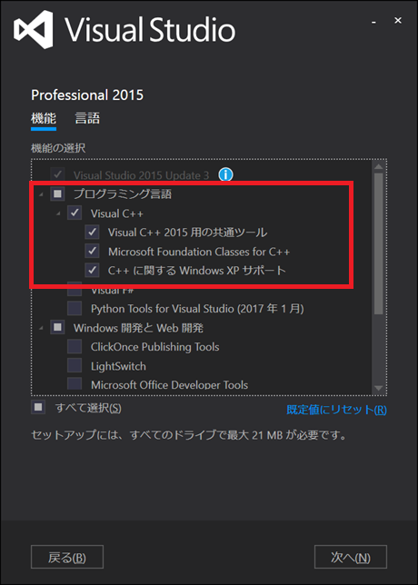
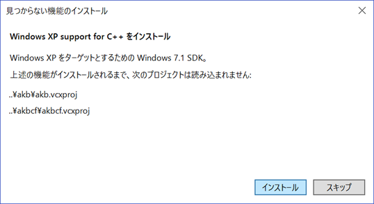
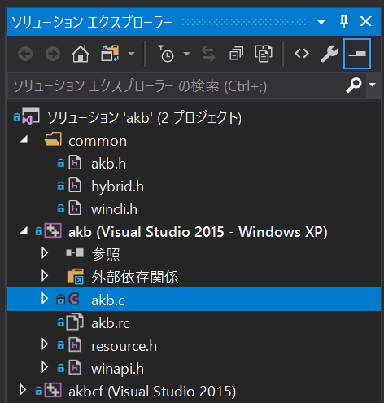
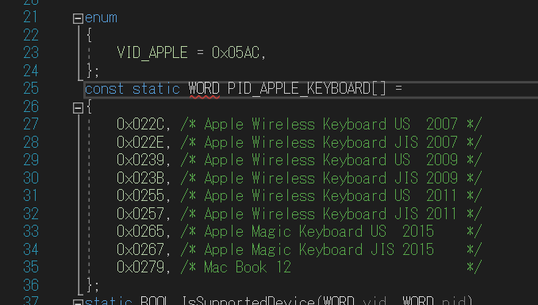
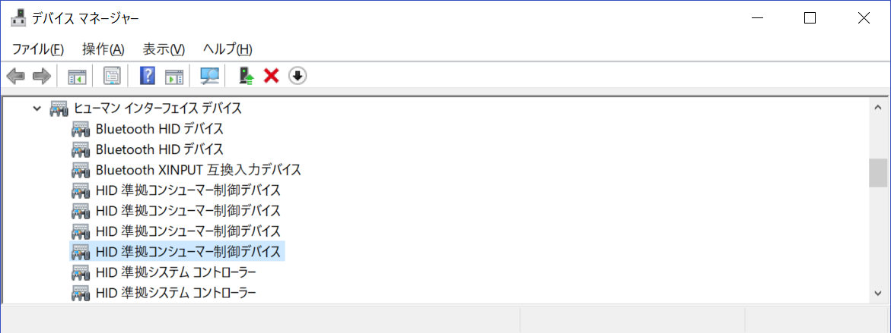
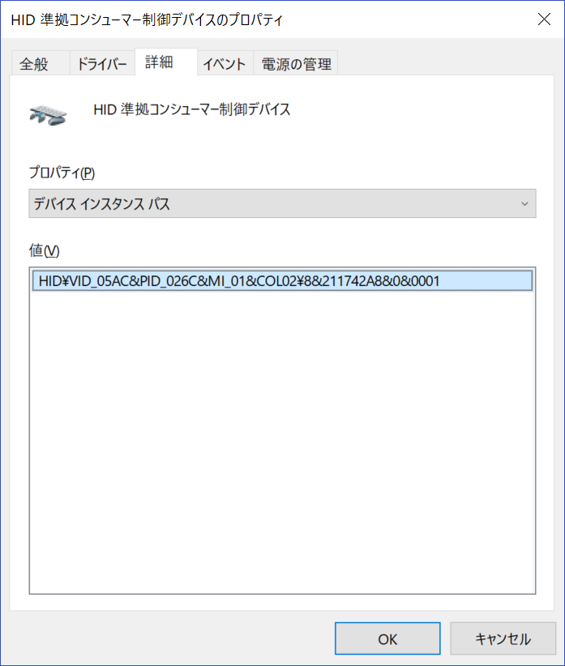
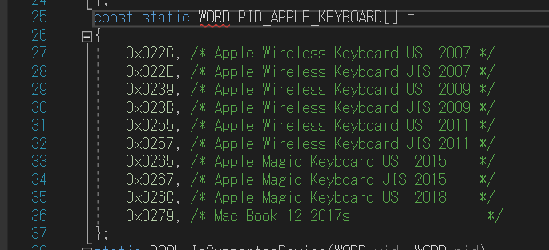
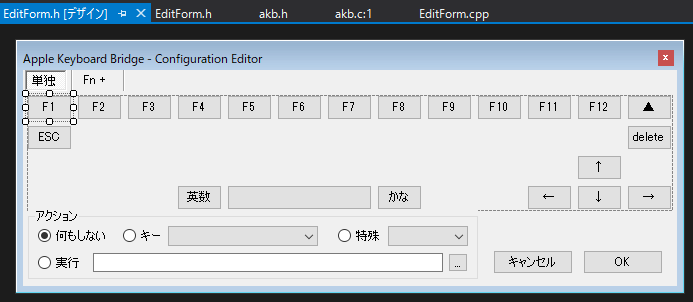

Apple Keyboard Bridge
=====================

version 0.1.3


Change Log
----------

* 0.1.3
  * Added support for Apple Magic Keyboard JIS/US 2015
  * Added monitor brightness command
* 0.1.2
  * Added "Zenkaku/Hankaku" for key mapping
* 0.1.1
  * Added support for Apple Wireless Keyboard JIS/US 2011


Purpose
-------

The Apple Keyboard Bridge is a tool that enables using of
Apple Wireless Keyboard with Windows bluetooth connection.

* Fn+ combination keys
* Eject, 英数 and かな keys

Requirements
------------

* Windows XP or greater
* Windows standard bluetooth stack


License
-------

2-clause BSD license


# 杉原追記
## ビルド環境
必要なものVisual Studio 2015(VCのコンパイラがVS2015になってるのでVS2017とかではダメのようです)

Visual Studio 2015のセットアップで必要なもの



またプロジェクトを起動したときに以下画面が出るので「インストール」をクリックしてください




## Apple Magic KeyboardのPID追加方法

akbプロジェクトのakb.cにキーボードのPIDが指定されている



VID_APPLEとあるのがAppleのベンダーIDで、「0x05AC」である
その下のPID_APPLE_KEYBOARDにあるのがキーボードのPIDになります



akb.exeが起動しない場合はキーボードのPIDが登録されていない場合があります
追加するにはデバイスマネージャーで「ヒューマンインターフェイスデバイス」の配下にある「HID準拠コシューマー制御デバイス」の中からAPPLEのVID(=0x05AC)を持ったデバイスを探します
(以下では4つのHID準拠コンシューマー制御デバイスが在りますが、このうちのどれかがAppleKeyboardです)



「HID準拠コシューマー制御デバイス」のプロパティを開いて、「詳細」タブのプロパティを「デバイスインスタンスパス」にすると値が以下のようになります



先頭か

1. 「HID」は無視(ヒューマンインターフェイスデバイスの意味)
2. 「VID_05AC」とあるのがベンダーID「05AC」なのでAppleです
3. 「PID_026C」の"PID_"の部分を除いた"026C"がキーボードのPIDになるのでメモします。

このメモした値をPID_APPLE_KEYBOARDに追加(今回は35行目に追加)すればOKです




## Apple-Keyboard-Bridge解析

### 初めに
Win SDKで作ってありますが、なぜかC++ではなくC言語です

「new」や「delete」等C++表記が一切使えないので注意してください


### 開始
プログラムはMain()から始まる

Main()内はタスクトレイへのアイコンの登録ロジックになっている

タスクトレイにアイコンの登録が成功するとWinProc()のWM_CREATEの処理が走る

### WM_CREATE
WM_CREATEでは
```
/* low level keyboard hook */
Global.hHook = SetWindowsHookEx(WH_KEYBOARD_LL, LowLevelKeyboardProc, hInstance, 0);
```
の部分でグローバルフックを設定していて、LowLevelKeyboardProc()を登録しています

### LowLevelKeyboardProc()
LowLevelKeyboardProc()でキーの処理を行っています。
```
if (nCode == HC_ACTION) {
    LPKBDLLHOOKSTRUCT pkbs = (LPKBDLLHOOKSTRUCT)lParam;
    switch (pkbs->vkCode) {
    case VK_LSHIFT:
    case VK_RSHIFT:
    case VK_LMENU:
    case VK_RMENU:
    case VK_LCONTROL:
    case VK_RCONTROL:
        return CallNextHookEx(Global.hHook, nCode, wParam, lParam);
    }
    if (pkbs->dwExtraInfo == MY_EXTRA_INFO)
        return CallNextHookEx(Global.hHook, nCode, wParam, lParam);

    switch (wParam) {
    case WM_KEYDOWN:
    case WM_SYSKEYDOWN:
        if (OnKeyDown(pkbs->vkCode))
            return TRUE;
        break;
    case WM_KEYUP:
        if (OnScanUp(pkbs->scanCode))
            return TRUE;
        break;
    }
}
```
LowLevelKeyboardProc()はOnKeyDown()とOnScanUp()を呼び出すのが主な処理です

OnKeyDown()は
```
if (Status.Fn) {
    switch (vkCode) {
    case VK_BACK : return Fire(config.Fn.Del  );
    case VK_UP   : return Fire(config.Fn.Up   );
    case VK_DOWN : return Fire(config.Fn.Down );
    case VK_LEFT : return Fire(config.Fn.Left );
    case VK_RIGHT: return Fire(config.Fn.Right);
    case VK_F1   : return Fire(config.Fn.F1   );
    case VK_F2   : return Fire(config.Fn.F2   );
    case VK_F3   : return Fire(config.Fn.F3   );
    case VK_F4   : return Fire(config.Fn.F4   );
    case VK_F5   : return Fire(config.Fn.F5   );
    case VK_F6   : return Fire(config.Fn.F6   );
    case VK_F7   : return Fire(config.Fn.F7   );
    case VK_F8   : return Fire(config.Fn.F8   );
    case VK_F9   : return Fire(config.Fn.F9   );
    case VK_F10  : return Fire(config.Fn.F10  );
    case VK_F11  : return Fire(config.Fn.F11  );
    case VK_F12  : return Fire(config.Fn.F12  );
    case VK_ESCAPE: return Fire(config.Fn.Esc );
    }
}
else
{
    switch (vkCode) {
        //MAC BOOK 12 (Fn + ESC on BootCamp)
    case VK_PAUSE: return Fire(config.Fn.Esc);
    }
}
return FALL_THROUGH;
```

OnScanUp()は
```
```


### スペシャルキーの処理
ただしFnキー/Ejectキー/Powerキーは取得できないようなので、WM_CREATEのグローバルフックの処理の後にある
```
/* low level keyboard hook */
Global.hHook = SetWindowsHookEx(WH_KEYBOARD_LL, LowLevelKeyboardProc, hInstance, 0);

if (!SpecialKey_Prepare())
```
SpecialKey_Prepare()で該当ベンダー(=05AC)とPID(PID_APPLE_KEYBOARD配列に定義したPID)に該当する
HIDのハンドルを取得し、
```
SpecialKey.hThread = CreateThread(NULL, 0, SpecialKey_Thread, NULL, 0, NULL);
```
で別スレッドを作成します。
別スレッドの関数はSpecialKey_Thread()で無限ループしながらHIDからキー
（ここでいうキーは仮想キーコードではなくベンダー独自のキーコード)を取得し続けます

取得したキーを以下のコードでOnSpecial()とOnPower()を呼び出します
```
switch (SpecialKey.buffer[0]) {
case 0x11:
    OnSpecial(SpecialKey.buffer[1]);
    break;
case 0x13:
    OnPower(SpecialKey.buffer[1] == 1);
    break;
}
```
OnSpecial()は先頭の
```
Status.Fn = (state & SPECIAL_FN_MASK) == SPECIAL_FN_ON;
```
でFnキーを判定しています。
そのあとの
```
if ((state & SPECIAL_EJECT_MASK) == SPECIAL_EJECT_ON) {
    if (Status.Fn)
        Fire(config.Fn.Eject);
    else
        Fire(config.Key.Eject);
}
```
でEjectキーを処理しています

OnPower()では
```
if (power)
    Fire(config.Key.Power);
```
でPowerキーの処理を行っています

## akbcf
Apple Keyboard Bridgeは2つのEXEからできています

１つはC言語＋WindowsSDKで書かれた`akb`で、これが本体

もう１つはManeged C++で書かれた`akbcf`で、これは設定を変更するFormアプリケーションになります

`akbcf`は`akb`から呼び出されます

`akbcf`で難しいのがタブコントロールで`単独`タブ



と、`Fn+`タブ


見た目は変わらないが、アクショングループより上にある`F１`等のラジオボタンは
コントロールが全く異なっている
(=`F1`の例で、`単独`タブでは`F1`ラジオボタンで、`Fn+`タブでは`FnF1`ラジオボタン)
ので注意してください。

タブが切り替わった時のコントロールの無効化は、ラジオボタンの`Enabled`プロパティを`false`に設定してあります

### akbcf呼び出し
`akb.c`の`WinProc()`内の以下の部分で起動しています
```
case WM_COMMAND:
    switch (LOWORD(wParam)) {
    case ID_CONF:
        {
            TCHAR cmd[MAX_PATH];
            GetModuleFileName(NULL, cmd, ARRAYSIZE(cmd));
            lstrcpy(cmd + lstrlen(cmd) - 4, TEXT("cf"));
            Exec(cmd);
        }
        break;
```

## commonプロジェクト
commonプロジェクトは`akb`と`akbcf`の2つのプロジェクト両方から参照される
ヘッダがあります

`akbcf`の仮想キーの定義は`wincli.h`に定義されています

`akb.h`の以下に追加したときは
```
enum
{
	/* single action keys */
	CONFIG_INIT_KEY_POWER = FIRE_POWER,
    ...
	CONFIG_INIT_FN_RIGHT  = VK_END,
	CONFIG_INIT_FN_EJECT  = FIRE_EJECT,
	//2019.07.15:SUGIHARA:ADD >>>>>
	CONFIG_INIT_FN_ESC    = VK_PAUSE,
	//2019.07.15:SUGIHARA:ADD <<<<<
};
```

managed c++で使う仮想キーコードを`wincli.h`に追加することを忘れないでください
```
enum
{
	VK_BACK       = 0x08, // Back Space

	//2019.07.15:SUGIHARA:ADD >>>>>
	VK_PAUSE      = 0x13, // PAUSE
	//2019.07.15:SUGIHARA:ADD <<<<<

	VK_KANJI      = 0x19,
    ...
	VK_MEDIA_PLAY_PAUSE  = 0xB3,
	VK_LAUNCH_MAIL       = 0xB4,
 };

```